# Heat

This repository contains contains the files from two other repositories. The
aim is to create an R package out of these two repositories:

1. [EnergyCalculatoR](https://github.com/emunozh/EnergyCalculatoR)
2. [UvalR](https://github.com/emunozh/UvalR)

**!! The Documentation below refers to the repositories mentioned above not the
package on this repository!!**

## How to build this package from source

```
R CMD build heat
R CMD INSTALL heat_1.0.tar.gz
R CMD check heat
```

# EnergyCalculatoR

The Energy Calculator consist of a single small scrip written in the R
language, which provides a function that accepts a range or parameters.  The
script has to be run in order to make the function accessible.  We can run the
script via:

```R
source("./Energy_Calculator.r")
```

That means that the file 'Energy_Calculator.r' has to be on the working path of
the main script.  You could alternatively give an absolute path to the command,
e.g:

```R
source("~/r/func/Energy_Calculator.r")
```

see the folder `./Examples` for some simple examples on how to use this
function.

## Some Examples:

### (1) Computing the monthly heat demand of a building.

The following code shows a minimal example on how to
compute the monthly heat demand of the *base* building:

```R
source("./Energy_Calculator.r")

temp.1 <- Energy_Calculator(Building.Orientation = 0,
                            Output.Type = "Month")
Qhm <- temp.1$Qhm
barplot(Qhm)
```

Notice the parameter `Output.Type = "Month"`. The default value of this
parameter is `Output.Type = "Year"`. The default is set to `Year`.

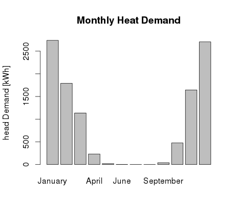

### (2) Computing the heat demand for a set of buildings.

In this example we change some parameters iteratively and store them in a variable.
This example show the heat demand variation for different
U-values combinations:

```R
source("./Energy_Calculator.r")

Buildings.Number <- 9
U.Values <- matrix(c(
1.3,  1.0,	3.0,    # 01
1.2,	0.9,	2.7,    # 02
1.1,	0.8,	2.7,    # 03
1.0,	0.7,	2.7,    # 04
0.9,	0.6,	2.4,    # 05
0.8,	0.5,	2.1,    # 06
0.6,	0.4,	1.9,    # 07
0.5,	0.3,	1.6,    # 08
0.4,	0.2,	1.6),   # 09
3,Buildings.Number)

Heat.Demand <- rep(0,Buildings.Number)
for (i in 1:Buildings.Number){
UvalW <- U.Values[1,i]
UvalR <- U.Values[2,i]
UvalWindow <- U.Values[3,i]
temp.2 <- Energy_Calculator(Building.UvalW = UvalW,
                            Building.UvalR = UvalR,
                            Building.UvalWindow = UvalWindow)
Heat.Demand[i] <- temp.2$Qhs
}

barplot(Heat.Demand)
```

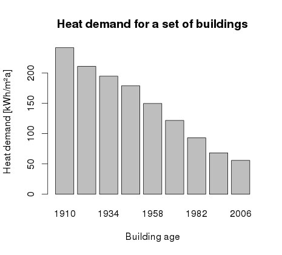

### (3) Computing the effect of building orientation.

For a given building dimensions we want to compute the heat demand for all
possible orientations, and plot the result in a polar plane. For the plot we
use the `ggplot2` library:

```R
library(ggplot2)
source("./Energy_Calculator.r")

iter <- seq(0,360,1)
Heat.Demand = rep(0,length(iter))

for (i in 1:length(iter)){
    BO <- iter[i]
    temp.2 <- Energy_Calculator(Building.Orientation = BO)
    Heat.Demand[i] <- temp.2$Qhs
}

result <- data.frame(heat.demand = Heat.Demand,
                        orientation = iter)
doh <- ggplot(result, aes(orientation, heat.demand))
doh + geom_line(colour = "red", size = 1)  +
    coord_polar(direction = -1, start = -pi/2) +
    labs(title = "Heat demand for all posible building orientations") +
    scale_x_continuous(breaks=seq(0, 360, 15))
```

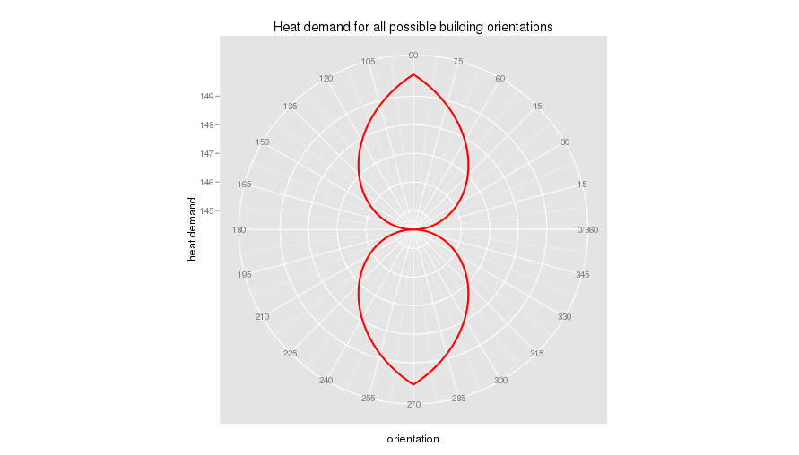

# UvalR

This simple script computes the U-Value for building components given the
characteristics of the individual layers of the component. The script also has a
small implementation which reads from an external file the properties of the
individual layers given an specific name. In order to make the functions
described on the main script 'Uval.R' you have to run in within your working
session via:

```R
source("./Uval.R")
```

This means that the main script 'Uval.R' has to be in the working path of your
environment. You can't just call the script using an absolute path as the scrip
will use the folder structure of the root folder. The easiest way to make sure 
that R finds the script is to point R into the right directory with the 'setwd()' 
command:

```R
setwd("~/workspace/R/UvalR")
```

The root folder structure is as follows::

```
+ root
|---Data     # The script will look for a csv file containing materials data
|               in this directory. The csv name has to be 'materials.csv'
|---Examples # Some examples on how to run the script.
|---FIGURES  # The script will store the plots here.
|---TABLES   # And the corresponding result data here.
```

## Some examples:

All the examples presented below are stores in the folder `./Examples/`.

### (1) Reinforced concrete.

```R
# This example shows a simple use of the function
# from:
# Keller, B., & Rutz, S. (2010). Pinpoint: Key facts + figures for sustainable
# buildings. Basel: Birkhauser.

# Set the proper working directory
setwd("~/workspace/R/UvalR")

# Load local functions
source("./Uval.R")

Layers <- data.frame(
  name = c("External Plaster", "Expanded Polystyrene", 
           "Reinforced Concrete", "Internal Stuco"),
  Thicknes =     c(0.01, 0.18 , 0.25, 0.01),
  Conductivity = c(0.87, 0.038, 1.8,  0.7),
  Diffusion =    c(15, 30, 80, 6))

CalculateUval(Layers, k.t_e=-5,
              plottemp=TRUE, plotpress=TRUE,
              name="ReinforcedConcrete_", writetab=TRUE)
```

This script will output the value: 0.1973745, that the U value of the building
component in [W/m2K]

It will also write two figures in folder `./FIGURES/`

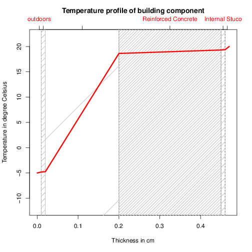
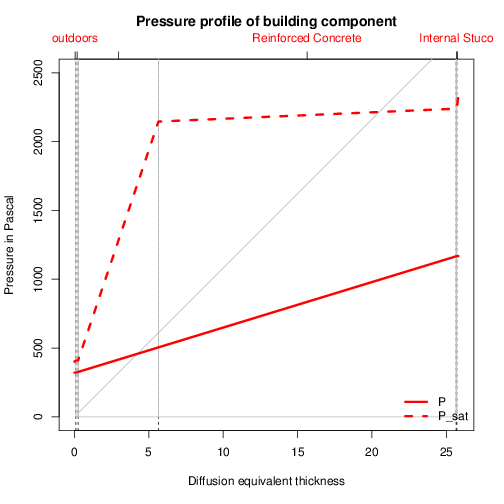

### (2) Light outside wall (Leichte Außenwand).

```R
# This example shows a simple use of the function
# from DIN 4108-3
# Konstruktion: Leichte Außenwand mit hinterlüfteter Vorsatzschale

# Set the proper working directory
setwd("~/workspace/R/UvalR")

# Load local functions
source("./Uval.R")

# Layers from Outside to Inside Layer
Layers <- data.frame(
  name = c(
    "Vorgehängte Außenschale",
    "Belüftete Luftschicht",
    "Spanplatte V100",
    "Mineralwolle",
    "Diffusionshemmende Schicht",
    "Spanplatte V20"),
  Thicknes = c(0.02, 0.03, 0.019, 0.16, 0.00005, 0.019),
  Conductivity = c(NaN, NaN, 0.127, 0.04, NaN, 0.127),
  Diffusion = c(NaN, NaN, 100, 1, 40000, 50))

CalculateUval(Layers, k.t_e=-5,
              plottemp=TRUE, plotpress=TRUE,
              name="leichteAussenwand_", writetab=TRUE)
```

   This script will output the value: 0.2240037, that the U value of the
   building component in [W/m2K]

   It will also write two figures in folder `./FIGURES/`

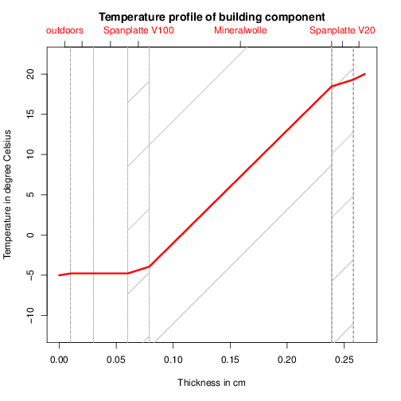
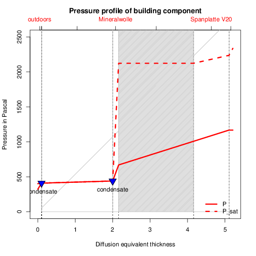

### (3) Internal insulation (Innendämmung).

```R
# This example shows a simple use of the function
# from DIN 4108-3
# B.5 Beispiel 4: Außenwand mit nachträglicher raumseitiger Wärmedämmung
# Konstruktion: Außenwand mit nachträglicher Innendämmung

# Set the proper working directory
setwd("~/workspace/R/UvalR")

# Load local functions
source("./Uval.R")

# Layers from Outside to Inside Layer
Layers <- data.frame(
  name = c(
    "Außenputz",
    "Mauerwerk",
    "EPS-Dämmstoff",
    "HWL-Platte",
    "Innenputz"),
  Thicknes = c(0.02,0.24,0.04,0.025,0.015),
  Conductivity = c(1,0.4,0.04,0.08,0.7),
  Diffusion = c(40,8,20,4,15))

CalculateUval(Layers, k.t_e=-5,
              plottemp=TRUE, plotpress=TRUE,
              name="Innendaemmung_", writetab=TRUE)
```
 
This script will output the value: 0.4719366, that the U value of the building
component in [W/m2K]

It will also write two figures in folder `./FIGURES/`

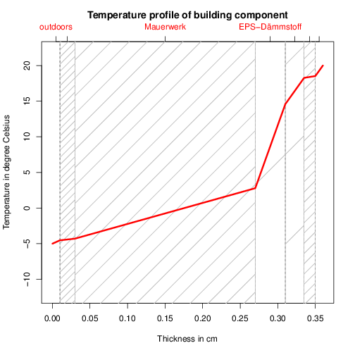
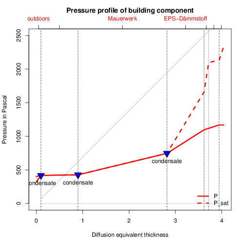

### (4) Using an external data file.

This examples uses an external data file containing the properties of the
different material layers. 

```R
# Reads some external data from a csv file and generates the layers to compute the U-val
# Reproduces the example 4 from DIN 4108-3, see ./Examples/Innendämmung.R

# Set the proper working directory
setwd("~/workspace/R/UvalR")

# Load local functions
source("./Uval.R")

MaterialsToget <- c(
  "Mineralischer_Edelputz",
  "Porensinterbeton_mit_Quarzsand_900",
  "EPS_040_30",
  "Holzwolle_Leichtbauplatten_Heraklith_Platten__Magnesia__390",
  "Mineralischer_Armierungsputz"
  )

Thicknes = c(0.02,0.24,0.04,0.025,0.015)

# Generate the Layers
Layers <- getLayers(MaterialsToget, Thicknes)

CalculateUval(Layers, k.t_e=-5,
              plottemp=TRUE, plotpress=TRUE,
              name="ExternalData_", writetab=TRUE)
```
 
This script will output the value: 0.4814479, that the U-value of the building
component in [W/m2K].

It will also write two figures in folder `./FIGURES/`

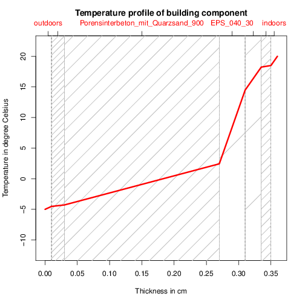

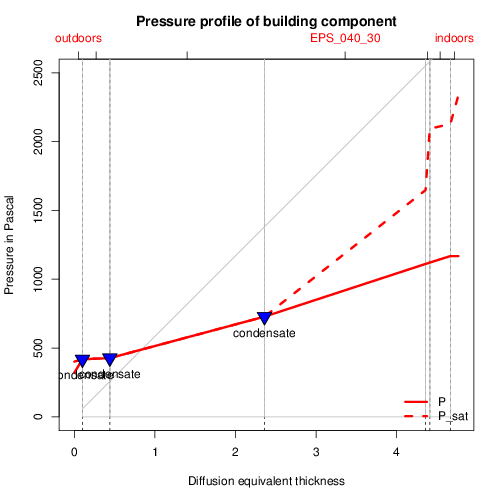
